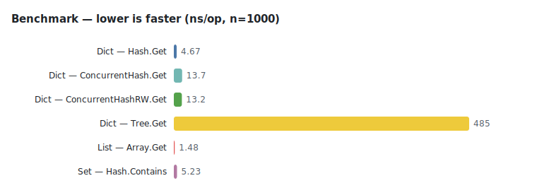

# Benchmark report

<!-- Generated by tools/benchreport — do not edit by hand. Regenerate with `make bench-report`. -->

This report is the full companion to the headline preview in the [README](README.md#performance). It surfaces two environments: a controlled **reference** machine (the trustworthy baseline) and the **CI** shared runner (indicative). Each is regenerated independently — the reference by a maintainer running `make bench-report` locally, the CI numbers on every push to `main`.

## Environments

### Reference — Framework Desktop (primary)

- **Machine:** Framework Desktop · AMD Ryzen AI MAX+ 395 · 128 GB unified memory · Arch Linux
- **Commit:** `91af082`
- **Generated (UTC):** 2026-06-16T19:59:00Z
- **Go:** go1.25.5
- **Runner:** linux/amd64
- **CPU:** AMD RYZEN AI MAX+ 395 w/ Radeon 8060S
- **Flags:** `-benchtime=20ms -count=2 -benchmem`
- **Packages:** github.com/pickeringtech/go-collections/collections/dicts, github.com/pickeringtech/go-collections/collections/lists, github.com/pickeringtech/go-collections/collections/sets

> ⚠️ The **CI** environment is a shared, noisy GitHub-hosted runner, so its numbers are **indicative, not authoritative** — trust them for orders of magnitude and relative comparisons only. The **reference** environment is a fixed, controlled machine and is the baseline the headline table and chart are drawn from.

## Headlines — Reference — Framework Desktop

| Operation | ns/op | B/op | allocs/op |
|---|--:|--:|--:|
| Dict — Hash.Get | 4.67 | 0 | 0 |
| Dict — ConcurrentHash.Get | 13.7 | 0 | 0 |
| Dict — ConcurrentHashRW.Get | 13.2 | 0 | 0 |
| Dict — Tree.Get | 485 | 0 | 0 |
| List — Array.Get | 1.48 | 0 | 0 |
| Set — Hash.Contains | 5.23 | 0 | 0 |

## Full results — Reference — Framework Desktop

### dicts

#### Filter

| Implementation | Size | ns/op | B/op | allocs/op |
|---|--:|--:|--:|--:|
| Hash | 10 | 105 | 0 | 0 |
| Hash | 100 | 1,895 | 3,208 | 7 |
| Hash | 1,000 | 27,751 | 54,152 | 15 |

#### ForEach

| Implementation | Size | ns/op | B/op | allocs/op |
|---|--:|--:|--:|--:|
| Hash | 10 | 60.6 | 0 | 0 |
| Hash | 100 | 413 | 0 | 0 |
| Hash | 1,000 | 5,742 | 0 | 0 |
| Hash | 10,000 | 49,527 | 0 | 0 |

#### Get

| Implementation | Size | ns/op | B/op | allocs/op |
|---|--:|--:|--:|--:|
| ConcurrentHash | 10 | 12.8 | 0 | 0 |
| ConcurrentHash | 100 | 13.2 | 0 | 0 |
| ConcurrentHash | 1,000 | 13.7 | 0 | 0 |
| ConcurrentHash | 10,000 | 13.8 | 0 | 0 |
| ConcurrentHashRW | 10 | 13.2 | 0 | 0 |
| ConcurrentHashRW | 100 | 13.7 | 0 | 0 |
| ConcurrentHashRW | 1,000 | 13.2 | 0 | 0 |
| ConcurrentHashRW | 10,000 | 13.2 | 0 | 0 |
| Hash | 10 | 3.68 | 0 | 0 |
| Hash | 100 | 4.16 | 0 | 0 |
| Hash | 1,000 | 4.67 | 0 | 0 |
| Hash | 10,000 | 5.54 | 0 | 0 |
| Tree | 10 | 5.58 | 0 | 0 |
| Tree | 100 | 48.3 | 0 | 0 |
| Tree | 1,000 | 485 | 0 | 0 |
| Tree | 10,000 | 4,248 | 0 | 0 |

#### Put

| Implementation | Size | ns/op | B/op | allocs/op |
|---|--:|--:|--:|--:|
| Hash | 10 | 587 | 937 | 7 |
| Hash | 100 | 4,940 | 10,229.5 | 13 |
| Hash | 1,000 | 60,639 | 163,632.5 | 26 |

#### PutInPlace

| Implementation | Size | ns/op | B/op | allocs/op |
|---|--:|--:|--:|--:|
| Hash | 10 | 184 | 34 | 1 |
| Hash | 100 | 220 | 48 | 2 |
| Hash | 1,000 | 536 | 267 | 2 |
| Hash | 10,000 | 1,601 | 2,475.5 | 3 |
| Tree | 10 | 227 | 82 | 2 |
| Tree | 100 | 369 | 92.5 | 3 |
| Tree | 1,000 | 1,472 | 217 | 3 |

#### Remove

| Implementation | Size | ns/op | B/op | allocs/op |
|---|--:|--:|--:|--:|
| Hash | 10 | 542 | 912 | 6 |
| Hash | 100 | 5,308 | 10,192 | 12 |
| Hash | 1,000 | 61,000 | 163,368 | 25 |

#### RemoveInPlace

| Implementation | Size | ns/op | B/op | allocs/op |
|---|--:|--:|--:|--:|
| Hash | 10 | 52.1 | 0 | 0 |
| Hash | 100 | 59.4 | 0 | 0 |
| Hash | 1,000 | 90.4 | 0 | 0 |
| Hash | 10,000 | 289 | 0 | 0 |

### lists

#### Filter

| Implementation | Size | ns/op | B/op | allocs/op |
|---|--:|--:|--:|--:|
| Array | 10 | 71.0 | 120 | 4 |
| Array | 100 | 331 | 1,016 | 7 |
| Array | 1,000 | 2,600 | 8,184 | 10 |
| Array | 10,000 | 26,658 | 128,248 | 16 |
| DoublyLinked | 10 | 75.2 | 120 | 4 |
| DoublyLinked | 100 | 362 | 1,016 | 7 |
| DoublyLinked | 1,000 | 2,864 | 8,184 | 10 |
| DoublyLinked | 10,000 | 29,182 | 128,248 | 16 |
| Linked | 10 | 79.6 | 120 | 4 |
| Linked | 100 | 371 | 1,016 | 7 |
| Linked | 1,000 | 2,856 | 8,184 | 10 |
| Linked | 10,000 | 32,606 | 128,248 | 16 |

#### ForEach

| Implementation | Size | ns/op | B/op | allocs/op |
|---|--:|--:|--:|--:|
| Array | 10 | 30.0 | 24 | 2 |
| Array | 100 | 156 | 24 | 2 |
| Array | 1,000 | 1,251 | 24 | 2 |
| Array | 10,000 | 11,485 | 24 | 2 |
| DoublyLinked | 10 | 32.6 | 24 | 2 |
| DoublyLinked | 100 | 152 | 24 | 2 |
| DoublyLinked | 1,000 | 1,128 | 24 | 2 |
| DoublyLinked | 10,000 | 10,485 | 24 | 2 |
| Linked | 10 | 33.0 | 24 | 2 |
| Linked | 100 | 147 | 24 | 2 |
| Linked | 1,000 | 1,223 | 24 | 2 |
| Linked | 10,000 | 10,501 | 24 | 2 |

#### Get

| Implementation | Size | ns/op | B/op | allocs/op |
|---|--:|--:|--:|--:|
| Array | 10 | 1.43 | 0 | 0 |
| Array | 100 | 1.48 | 0 | 0 |
| Array | 1,000 | 1.48 | 0 | 0 |
| Array | 10,000 | 1.50 | 0 | 0 |
| DoublyLinked | 10 | 2.17 | 0 | 0 |
| DoublyLinked | 100 | 8.52 | 0 | 0 |
| DoublyLinked | 1,000 | 177 | 0 | 0 |
| DoublyLinked | 10,000 | 2,136 | 0 | 0 |
| Linked | 10 | 2.65 | 0 | 0 |
| Linked | 100 | 26.4 | 0 | 0 |
| Linked | 1,000 | 392 | 0 | 0 |
| Linked | 10,000 | 4,137 | 0 | 0 |

#### Push

| Implementation | Size | ns/op | B/op | allocs/op |
|---|--:|--:|--:|--:|
| Array | 10 | 107 | 160 | 1 |
| Array | 100 | 239 | 1,792 | 1 |
| Array | 1,000 | 665 | 12,288 | 1 |
| DoublyLinked | 10 | 142 | 24 | 1 |
| DoublyLinked | 100 | 91.1 | 24 | 1 |
| DoublyLinked | 1,000 | 97.2 | 24 | 1 |
| Linked | 10 | 134 | 24 | 1 |
| Linked | 100 | 189 | 24 | 1 |
| Linked | 1,000 | 99.2 | 24 | 1 |

### sets

#### Add

| Implementation | Size | ns/op | B/op | allocs/op |
|---|--:|--:|--:|--:|
| ConcurrentHash | 10 | 55.9 | 0 | 0 |
| ConcurrentHash | 100 | 61.7 | 0 | 0 |
| ConcurrentHash | 1,000 | 74.3 | 0 | 0 |
| ConcurrentHashRW | 10 | 60.4 | 0 | 0 |
| ConcurrentHashRW | 100 | 68.8 | 0 | 0 |
| ConcurrentHashRW | 1,000 | 79.0 | 0 | 0 |
| Hash | 10 | 17,205 | 1,747 | 4 |
| Hash | 1,000 | 62.5 | 0 | 0 |

#### Contains

| Implementation | Size | ns/op | B/op | allocs/op |
|---|--:|--:|--:|--:|
| ConcurrentHash | 10 | 12.7 | 0 | 0 |
| ConcurrentHash | 100 | 13.1 | 0 | 0 |
| ConcurrentHash | 1,000 | 14.2 | 0 | 0 |
| ConcurrentHash | 10,000 | 14.4 | 0 | 0 |
| ConcurrentHashRW | 10 | 12.8 | 0 | 0 |
| ConcurrentHashRW | 100 | 12.5 | 0 | 0 |
| ConcurrentHashRW | 1,000 | 13.8 | 0 | 0 |
| ConcurrentHashRW | 10,000 | 14.0 | 0 | 0 |
| Hash | 10 | 4.52 | 0 | 0 |
| Hash | 100 | 5.32 | 0 | 0 |
| Hash | 1,000 | 5.23 | 0 | 0 |
| Hash | 10,000 | 6.42 | 0 | 0 |

#### ForEach

| Implementation | Size | ns/op | B/op | allocs/op |
|---|--:|--:|--:|--:|
| ConcurrentHash | 10 | 113 | 24 | 2 |
| ConcurrentHash | 100 | 527 | 24 | 2 |
| ConcurrentHash | 1,000 | 6,260 | 24 | 2 |
| ConcurrentHash | 10,000 | 55,887 | 24 | 2 |
| ConcurrentHashRW | 10 | 107 | 24 | 2 |
| ConcurrentHashRW | 100 | 519 | 24 | 2 |
| ConcurrentHashRW | 1,000 | 6,374 | 24 | 2 |
| ConcurrentHashRW | 10,000 | 58,334 | 24 | 2 |
| Hash | 10 | 116 | 24 | 2 |
| Hash | 100 | 596 | 24 | 2 |
| Hash | 1,000 | 6,663 | 24 | 2 |
| Hash | 10,000 | 60,231 | 24 | 2 |

#### PutInPlace

| Implementation | Size | ns/op | B/op | allocs/op |
|---|--:|--:|--:|--:|
| Tree | 10,000 | 17,014 | 1,741.5 | 4 |

